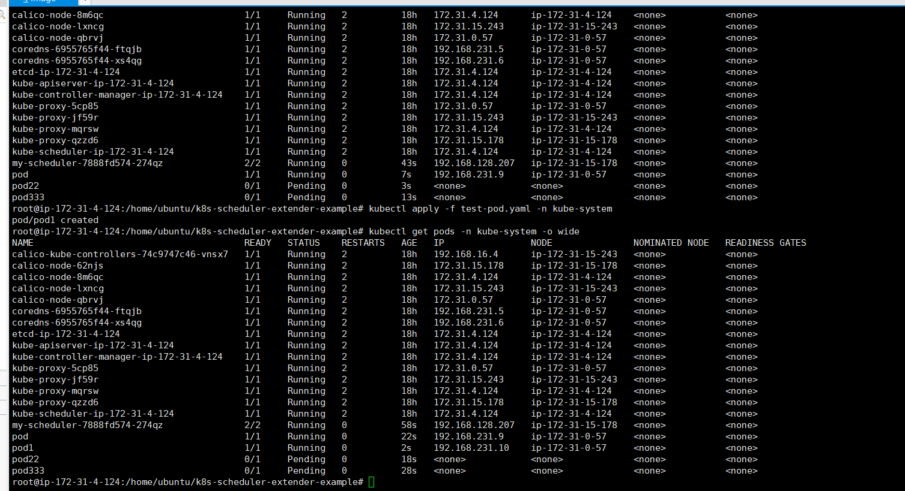
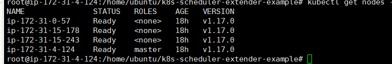

# 集群自定义调度程序实现

### 第一步，创建集群， 在aws上启动四个2cpu实例，master服务器的存储为40G，其他为16G

### 第二步，配置docker、k8s环境
```
##配置docker
$ apt-get update
$ ./docker.sh

##配置k8s
$ sudo apt-get update && apt-get install -y apt-transport-https
$ curl https://mirrors.aliyun.com/kubernetes/apt/doc/apt-key.gpg | apt-key add - 
$ cat <<EOF >/etc/apt/sources.list.d/kubernetes.list
$ deb https://mirrors.aliyun.com/kubernetes/apt/ kubernetes-xenial main
$ EOF
$ sudo apt-get update
$ sudo apt-get install -y kubelet kubeadm kubectl
```
### 第三步，初始化master节点，node节点加入集群
```
##master节点
$ kubeadm init
##会生成join指令

##node节点加入
$  把mster生成的join指令复制在节点服务器上运行

##查看nodes
kubectl get nodes -n kube-system

##8080错误
$ echo "export KUBECONFIG=/etc/kubernetes/admin.conf" >> ~/.bash_profile
$ source ~/.bash_profile

##节点notready状态解决
$ mkdir -p $HOME/.kube
$ sudo cp -i /etc/kubernetes/admin.conf $HOME/.kube/config
$ sudo chown $(id -u):$(id -g) $HOME/.kube/config
```

### 第四步,各种踩坑
#### 官方给的my-scheduler方法跑不过，虽然clone了它的git然后打包成自己的镜像仍然crashOffLoop
#### 各种尝试
#### 最后感谢cyx提供的github地址

### 第五步,自定义自己的scheduler
```
$ git clone https://github.com/everpeace/k8s-scheduler-extender-example.git
$ cd k8s-scheduler-extender-example
$ git submodule update --init
$ IMAGE=YOUR_ORG/YOUR_IMAGE:YOUR_TAG
$ docker build . -t "${IMAGE}"
$ docker push "${IMAGE}"
$ sed 's/a\/b:c/'$(echo "${IMAGE}" | sed 's/\//\\\//')'/' extender.yaml | kubectl apply -f -
$  kubectl get pods -o wide -n kube-system

##生成my-scheduler成功，但是是原本别人的priority和predicate,需要修改成自己的调度
##修改main.go文件里的调度函数
##predicate采用的是pod 名字长度大于5就return false,priority是名字短的node分数高
TruePredicate = Predicate{
		Name: "always_true",
		Func: func(pod v1.Pod, node v1.Node) (bool, error) {
			var valid bool
			const max int = 5
			valid = max > len(pod.Name)
			if valid {
				log.Printf("pod %v/%v length is %d, node length is %d fit on node %v\n", pod.Name, pod.Namespace, len(pod.Name), len(node.Name),node.Name)
				return true, nil
			}
			log.Printf("pod %v/%v length is %d,  node length is %d, not fit on node %v\n", pod.Name, pod.Namespace, len(pod.Name), len(node.Name),node.Name)
			return false, fmt.Errorf("pod length exceed ")
		},
##
ZeroPriority = Prioritize{
		Name: "zero_score",
		Func: func(_ v1.Pod, nodes []v1.Node) (*schedulerapi.HostPriorityList, error) {
			var priorityList schedulerapi.HostPriorityList
			const soc int = 20
			priorityList = make([]schedulerapi.HostPriority, len(nodes))
			for i, node := range nodes {
				priorityList[i] = schedulerapi.HostPriority{
					Host:  node.Name,
					Score: int64(soc-len(node.Name)),
				}
			}
			return &priorityList, nil
		},
##:wq保存，删除掉原来的my-scheduler,重新打包新的镜像tag
$ kubectl get pods -o wide -n kube-system
$ kubectl delete pods my-scheduler-XXXXXXXX-XXXXX -n kube-system
##还可能需要删除deployments
$ kubectl get deployments -n kube-system
$ kubectl delete deployments my-scheduler -n kube-system
$ IMAGE=YOUR_ORG/YOUR_IMAGE:YOUR_TAG
$ docker build . -t "${IMAGE}"
$ docker push "${IMAGE}"
$ sed 's/a\/b:c/'$(echo "${IMAGE}" | sed 's/\//\\\//')'/' extender.yaml | kubectl apply -f -
$  kubectl get pods -o wide -n kube-system
##就可以看到新的my-scheduler pod
## 生成pod查看调度算法
$ kubectl apply -f pod1.yaml -n kube-system
$ kubectl apply -f pod2.yaml -n kube-system
$ kubectl apply -f pod3.yaml -n kube-system
$ kubectl apply -f test-pod,yaml -n kube-system
$ kubectl get pods -o wide -n kube-system
$ kubectl get nodes -o wide -n kube-system
```


#### 可以看到pending的pod就是名字大于5的pod,running的pod先进入了名字最短的node

### 总结
#### k8s是一个非常实用的工具，虽然刚开始配置搭建花费了大量时间，但最终搭建出来还是挺有趣的，scheduler的调度策略需要更熟悉它才能更好的实现















